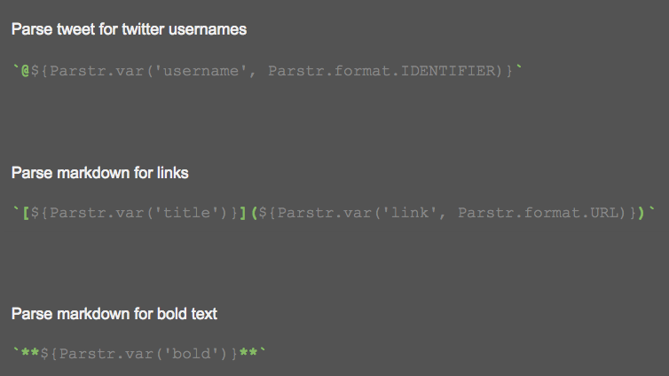

# Parstr API Design
The purpose of this document is to outline and collect design ideas for the Parstr API


The following image makes it easier to see the format of the template strings and how they will be used to create parsing rules for the returned parsing function.



## `Parstr.var(name, format)`

The var function takes a variable name to save any parsed values to, and a format to filter values by. If the substring in that position does not match up to the format, it will be rejected and NOT extracted from the string.

**Parsing quotes**
```javascript
var quoteParser = new Parstr({
  quotes: `"${Parstr.var('quote')}"`
});

var parsed = quoteParser('"Stop reading," he said, "Stop it!"');

console.log(parsed);
```

```javascript
{
  quotes: [
    {quote: 'Stop reading,', _location: [0, 14]},
    {quote: 'Stop it!', _location: [25, 34]}
  ]
}
```

**Parsing markdown bold text**
```javascript
var boldParser = new Parstr({
  bolds: `**${Parstr.var('bold')}**`
});

var parsed = boldParser('Hello **world**');

console.log(parsed);
```

```javascript
{
  bolds: [{bold: 'world', _location: [6, 14]}]
}
```

**Parsing a tweet**

```javascript
var twitterParser = new Parstr({
  usernames: `@${Parstr.var('username', Parstr.format.IDENTIFIER)}`,
  hashtags: `#${Parstr.var('hashtag', Parstr.format.HASHTAG)}`
});

var parsed = twitterParser('@joe how are you? #bored');

console.log(parsed);
```

```javascript
{
  usernames: [{username: 'joe', _location: [0, 3]}],
  hashtags: [{hashtag: 'bored', _location: [18, 23]}]
}
```

**Parsing a markdown link**
```javascript
var linkParser = new Parstr({
  links: `[${Parstr.var('title')}](${Parstr.var('link', Parstr.format.URL)})`
});

var parsed = linkParser('check out [my website](https://www.craigharrison.me)');

console.log(parsed);
```

```javascript
{
  links: [{title: 'my website', link: 'https://www.craigharrison.me', _location: [10, 51]}]
}
```

## `Parstr.format`
Formats allow the user to pass in a format to change how Parstr looks for data within a string. There should be a ton of format options in order to not limit the API's parsing capabilities.

All of these formats will be backed by a specific regular expression. So adding a lot of them will be busy work more than anything.

### ANY
Any character is allowed

### ALPHABETIC
Only alphabetic characters are allowed

### ALPHANUMERIC
Only letters and numbers are allowed, no symbols, like -, +, *

### IDENTIFIER
Similar to JavaScript variable naming rules

The general rules for identifiers are:

+ can contain letters, digits, underscores, and dollar signs
+ must begin with a letter
+ can also begin with $ and _

### URL
Using [RFC 1738](http://www.faqs.org/rfcs/rfc1738.html)

Thus, only alphanumerics, the special characters `$-_.+!*'(),`

### URL_FRIENDLY
Only `A-Za-z0-9_-` allowed. No spaces.

### NO_SPACE
No spaced are allowed in the string

### FILE_NAME
Only valid filenames allowed

### EMAIL
Only valid emails allowed

### DATE
Only valid dates allowed

## Ideas
+ Recursive parsers for things like embedded html
+ Sub parsers that will parse a parsed value
+ Replacement parser that will not only extract data but create a new string with the values replaced in a new format

```javascript
var replaceParser = new Parstr({
  equations: `=(${ Parstr.replace(eval) })`
}, true);

var parsed = replaceParser('The =(202 + 202) error');
//    => 'The 404 error'

```
